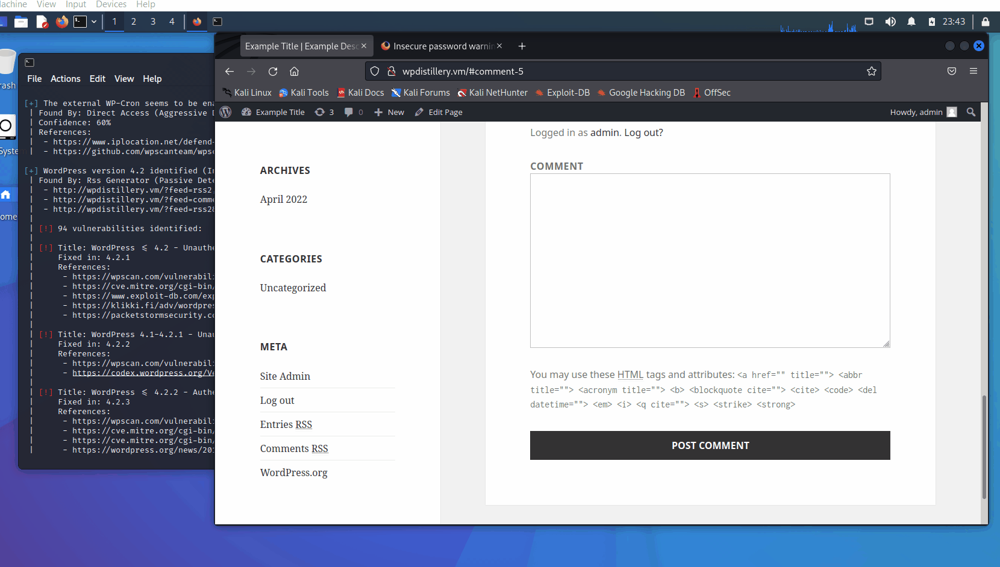
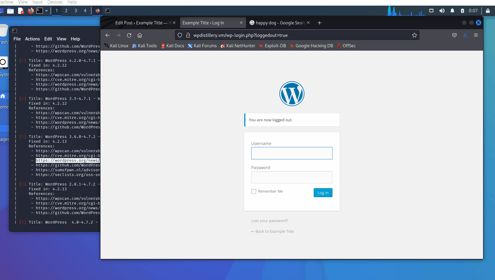

# Codepath-Week-7-8

# Project 7 - WordPress Pentesting

Time spent: **X** hours spent in total

> Objective: Find, analyze, recreate, and document **five vulnerabilities** affecting an old version of WordPress

## Pentesting Report

### 1. Authenticated XSS in comments (CVE-2019-9787)
  - [ ] Summary: Wordpress before 5.1.1 does not properly filter comments, leading to remote code execution by unauthenticated user configuration.  
    - Vulnerability types: Cross-Site Scripting (XSS)
    - Tested in version:3.9-5.1
    - Fixed in version: 4.2.23
  - [ ] GIF Walkthrough: 
  - [ ] Steps to recreate: 
  - [ ] Affected source code:
    - [Link 1](https://wpscan.com/vulnerability/8051e64b-f73e-45ce-a853-02b8e425155b)
    - [Link 2](https://www.exploit-db.com/exploits/36844)
    - [Link 3](https://wpdistillery.php)

### 2. Authenticated Cross-Site Scripting (XSS) via Media File Metadata (CVE-2017-6814)
  - [ ] Summary:
    - Vulnerability types: Authenticated XSS in comments field
    - Tested in version: 4.2
    - Fixed in version: 4.2.13
  - [ ] GIF Walkthrough: 
  - [ ] Steps to recreate: 
  - [ ] Affected source code:
    - [Link 1](https://wpscan.com/vulnerability/2c5632d8-4d40-4099-9e8f-23afde51b56e)
    - [Link 2](https://wordpress.org/news/2017/03/wordpress-4-7-3-security-and-maintenance-release/)
    - [Link 3](https://wpdistillery.php)

### 3. User Enumeration (CVE-2020-7918)
  - [ ] Summary: 
    - Vulnerability types: User Authentication
    - Tested in version: 4.2
    - Fixed in version: 
  - [ ] GIF Walkthrough: 
  - [ ] Steps to recreate: 
  - [ ] Affected source code:
    - [Link 1](https://wpdistillery.php)
    - [Link 2](https://core.trac.wordpress.org/browser/tags/version/src/source_file.php)

## Assets

List any additional assets, such as scripts or files

## Resources

- [WordPress Source Browser](https://core.trac.wordpress.org/browser/)
- [WordPress Developer Reference](https://developer.wordpress.org/reference/)

GIFs created with [LiceCap](http://www.cockos.com/licecap/).

## Notes

Describe any challenges encountered while doing the work

## License

    Copyright [yyyy] [name of copyright owner]

    Licensed under the Apache License, Version 2.0 (the "License");
    you may not use this file except in compliance with the License.
    You may obtain a copy of the License at

        http://www.apache.org/licenses/LICENSE-2.0

    Unless required by applicable law or agreed to in writing, software
    distributed under the License is distributed on an "AS IS" BASIS,
    WITHOUT WARRANTIES OR CONDITIONS OF ANY KIND, either express or implied.
    See the License for the specific language governing permissions and
    limitations under the License.
